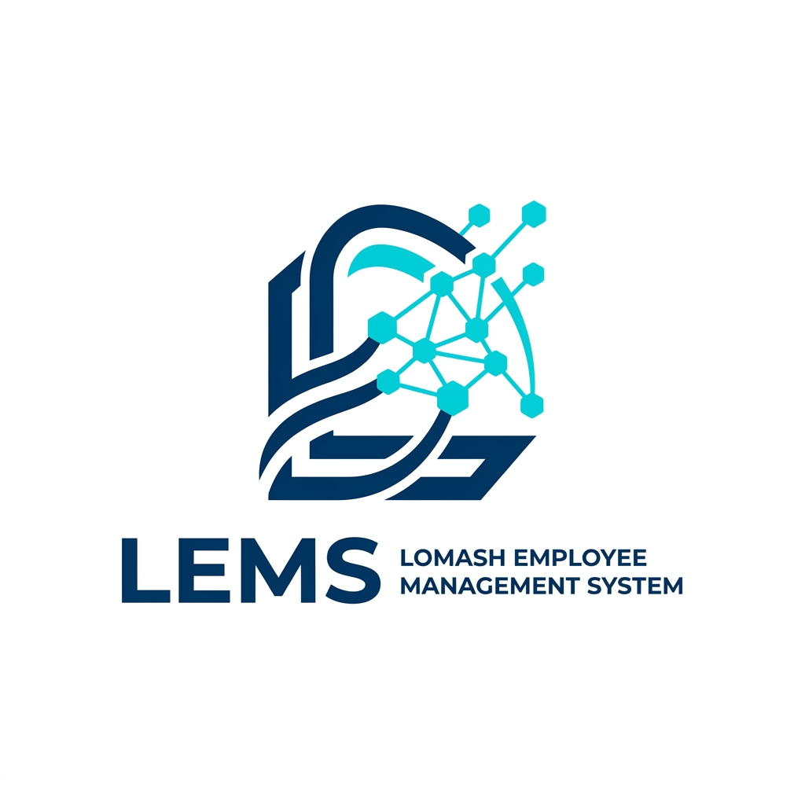
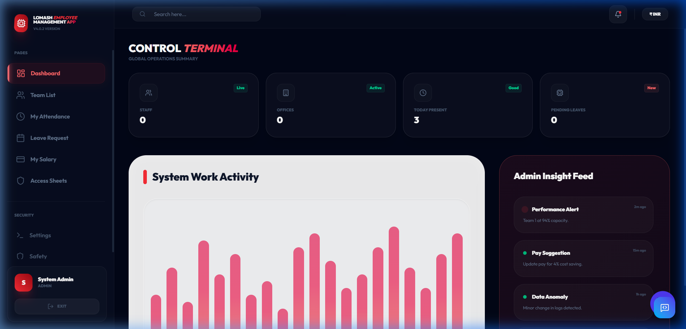

# LEMS: Smart Employee Management System



## 🚀 Overview
**LEMS (Lomash Employee Management System)** is a high-fidelity, enterprise-grade workforce management platform. It combines modern web technologies with AI-driven analytics to streamline HR operations, automate payroll, manage real-time attendance, and provide predictive insights into employee attrition.

Designed with a **Neural UI** aesthetic, the platform offers a futuristic, glassmorphic interface that is as functional as it is beautiful.

---

## 📸 Screenshots

### 🖥️ Admin Control Terminal
The central hub for managing global operations, tracking staff counts, and viewing live attendance.


### 📊 Clean State (Ready for Data)
The system initializes in a clean state, ready for your custom data entry via the Admin Panel.


### 📂 Module Gallery
| **Attendance Tracking** | **Payroll Management** |
|:---:|:---:|
|  |  |
| **Leave Requests** | **Employee Onboarding** |
|  |  |

---

## ✨ Key Features
- **Neural UI/UX**: Premium design with glassmorphism, fluid animations, and dark-mode optimization.
- **AI Insights**:
    - **Attrition Prediction**: Identifies high-risk employees based on workload and satisfaction.
    - **Resume Intelligence**: Auto-parses candidate skills and experience.
    - **HR Chatbot**: NLP-powered assistant for automated query resolution.
- **Real-time Operations**: WebSocket-driven live attendance tracking (Check-in/Check-out).
- **Automated Payroll**: One-click salary generation with PDF payslip exports, processed via background queues (BullMQ/Redis).
- **Security**: JWT Authentication, RBAC (Admin/Staff), Rate Limiting, and Data Sanitization.

---

## 🛠️ Tech Stack
- **Frontend**: React 19, Vite, Tailwind CSS v4, Framer Motion, Zustand, Recharts.
- **Backend**: Node.js (ESM), Express.js, MongoDB (Mongoose), Socket.io.
- **AI Service**: Python FastAPI, NumPy, Pydantic.
- **Infrasctructure**: Docker, Docker Compose, Nginx (Reverse Proxy), Redis.

---

## 🚀 Quick Start (Local Docker)

### 1. Prerequisites
- Docker & Docker Compose installed.
- MongoDB Atlas account (or use the local container included).

### 2. Configuration
Create a `.env` file from the template:
```bash
cp .env.example .env
```

### 3. Launch
```bash
docker-compose up -d --build
```

### 4. Initialize Database
Create the primary admin account:
```bash
docker-compose exec backend node seed.js --force
```

### 🔑 Credentials
- **Admin Email**: `admin@lems.com`
- **Admin Password**: `admin12@lems.com`

---

---

## ☁️ Deployment

### 1. Frontend (Netlify)
Netlify is the best choice for hosting the "Neural" UI.
1. **Connect Repository**: Log in to [Netlify](https://www.netlify.com/) and select "Import from GitHub".
2. **Build Settings**:
   - **Build Command**: `npm run build`
   - **Publish Directory**: `dist`
3. **Environment Variables**: Add `VITE_API_URL` and set it to your **Render Backend URL** (e.g., `https://ems-backend.onrender.com/api/v1`).

### 2. Backend & AI (Render)
Use the `render.yaml` (Blueprint) to deploy the backend services.
1. **Blueprint**: In [Render](https://render.com/), click "New" -> "Blueprint" and connect your repo.
2. **Configuration**: Render will provision `ems-backend`, `ems-ai-service`, and `ems-redis`.
3. **Manual Settings**: In the `ems-backend` settings, add `MONGO_URI` and `JWT_SECRET`.


---

## 👨‍💻 Author
**Lomash Srivastava**

## 📄 License
MIT License
